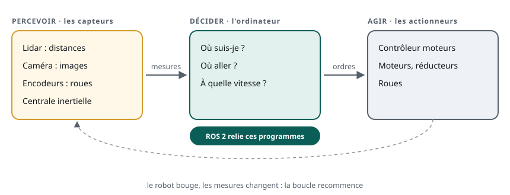
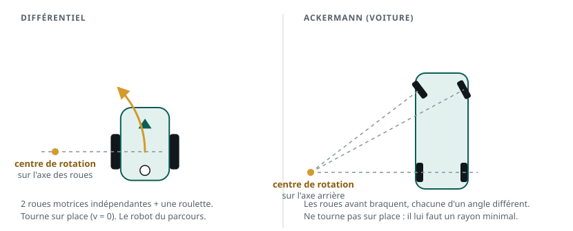
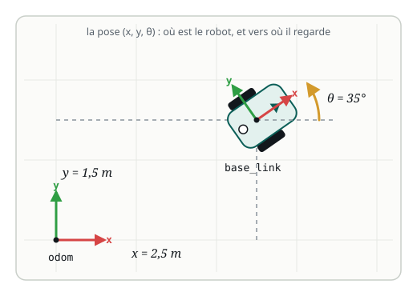
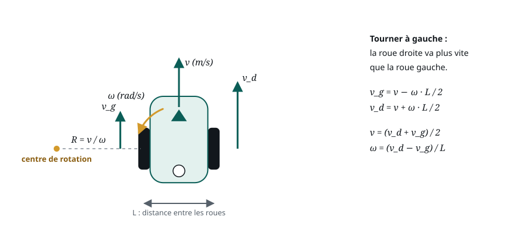
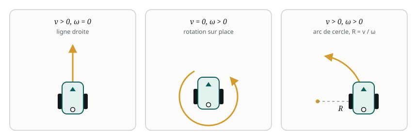

# Le robot mobile

> **La situation.** Vous rejoignez une équipe qui développe un petit robot de livraison à deux roues, pour un entrepôt. Avant d'écrire le moindre programme, il faut comprendre la machine : ce qu'elle perçoit, comment elle bouge, et avec quels nombres on lui dit où aller. C'est ce vocabulaire que ROS 2 manipulera dans tout le parcours.

**Dans ce module, vous allez :**

- comprendre l'architecture d'un robot mobile : capteurs, calcul, actionneurs ;
- décrire la position et l'orientation d'un robot, et son propre repère ;
- commander un robot avec deux nombres, la vitesse linéaire `v` et la vitesse angulaire `ω`, et prévoir sa trajectoire ;
- faire rouler le robot simulé du lab pour vérifier tout cela.

Ce module ne demande aucune connaissance de ROS. Il se termine par un QCM.

## L'essentiel en théorie

- Un robot mobile **perçoit** (capteurs), **décide** (calcul) et **agit** (actionneurs), en boucle.
- Sa **pose** tient en trois nombres dans le plan : la position `(x, y)` et l'orientation `θ`.
- Il a son **propre repère**, `base_link` : `x` vers l'avant, `y` vers la gauche.
- On le commande avec deux vitesses : `v` (m/s) pour avancer, `ω` (rad/s) pour tourner. Pour un robot à deux roues, ces deux nombres fixent la vitesse de chaque roue.
- Avec `v` et `ω` constants, le robot décrit un **cercle de rayon `R = v / ω`** : une ligne droite si `ω = 0`, une rotation sur place si `v = 0`.
- Naviguer, c'est enchaîner : savoir où l'on est (localisation), choisir un chemin (planification), le suivre en ajustant `v` et `ω` (commande).

## 1. Qu'est-ce qu'un robot mobile ?

Un **robot** est une machine qui perçoit son environnement, décide de ce qu'elle doit faire et agit sur le monde, sans qu'un humain la pilote à chaque instant. Il est **mobile** quand il se déplace lui-même : sur des roues, des chenilles, des pattes, ou en volant. Un bras robotisé fixé à son établi, lui, est un **manipulateur**.

On en croise partout :

| Robot | Où | Ce qu'il fait |
|---|---|---|
| AMR (*Autonomous Mobile Robot*) | entrepôts, hôpitaux | transporte des colis, des chariots, des médicaments |
| Robot aspirateur | maisons | couvre toute la surface d'une pièce |
| Robot de livraison | trottoirs, campus | apporte un repas ou un colis au destinataire |
| Rover | Mars, mines, agriculture | explore et mesure là où l'humain va difficilement |
| Drone | inspection, cartographie | survole ponts, champs ou lignes électriques |

Notre **robot de livraison** est un AMR d'entrepôt : un châssis, deux roues motrices, une roulette libre, un laser pour voir les obstacles et un petit ordinateur embarqué.

## 2. L'architecture d'un robot

Tous les robots mobiles suivent la même boucle :



1. **Percevoir.** Les capteurs mesurent le monde et le robot lui-même : distances aux obstacles, images, rotation des roues.
2. **Décider.** L'ordinateur embarqué transforme ces mesures en décisions : où suis-je ? où aller ? à quelle vitesse ?
3. **Agir.** Les actionneurs exécutent : le contrôleur des moteurs fait tourner chaque roue à la vitesse demandée.

Puis le robot a bougé, les mesures ont changé, et la boucle recommence, des dizaines de fois par seconde.

On distingue souvent deux étages de calcul :

- le **bas niveau**, un microcontrôleur proche du matériel, qui asservit les moteurs en temps réel (des milliers de fois par seconde) ;
- le **haut niveau**, un ordinateur embarqué (Raspberry Pi, Jetson, PC industriel), qui localise le robot, planifie et décide.

**ROS 2 vit au haut niveau** : chaque tâche y est un programme séparé (lire le laser, estimer la position, planifier…), et ROS 2 les fait communiquer. C'est l'objet de la suite du parcours.

## 3. Capteurs et actionneurs

Un **capteur** transforme une grandeur physique en mesure. Deux familles :

- les capteurs **proprioceptifs** mesurent le robot lui-même ;
- les capteurs **extéroceptifs** mesurent son environnement.

| Capteur | Famille | Ce qu'il mesure |
|---|---|---|
| Encodeur de roue | proprioceptif | la rotation de chaque roue (donc la distance parcourue) |
| Centrale inertielle (IMU) | proprioceptif | les accélérations et les vitesses de rotation |
| Lidar (laser) | extéroceptif | les distances aux obstacles, tout autour, des milliers de points par seconde |
| Caméra | extéroceptif | des images ; avec une caméra de profondeur, aussi la distance de chaque pixel |
| Ultrasons, bumpers | extéroceptif | un obstacle proche, un contact |
| GPS | extéroceptif | la position sur la Terre, en extérieur seulement, à quelques mètres près |

Un **actionneur** transforme un ordre en action physique. Sur un robot mobile, ce sont surtout les **moteurs** (à courant continu ou *brushless*), avec un **réducteur** qui échange de la vitesse contre de la force, et leur **contrôleur**, qui maintient la vitesse demandée malgré la charge ou la pente. S'y ajoutent selon le robot : un servomoteur de direction, un bras, une pince, des voyants, un haut-parleur.

Aucun capteur n'est parfait : les encodeurs se trompent quand une roue patine, le GPS ne passe pas à l'intérieur, le lidar ne voit pas une vitre. Un robot fiable **combine** plusieurs capteurs.

## 4. Différentiel ou Ackermann : comment tourner ?

La façon dont un robot tourne dépend de sa **cinématique**, c'est-à-dire de la disposition de ses roues.



| | Différentiel | Ackermann (voiture) |
|---|---|---|
| Roues motrices | deux, indépendantes, sur un même axe | en général l'essieu arrière |
| Pour tourner | les deux roues vont à des vitesses différentes | les roues avant braquent |
| Tourner sur place | oui | non : il faut un rayon de braquage minimal |
| Usage typique | robots d'intérieur, aspirateurs, AMR | véhicules rapides, extérieur, voitures autonomes |

Il existe aussi des robots **omnidirectionnels** (roues *mecanum* ou omni), qui se déplacent de côté sans tourner, et des robots à **chenilles**, qui tournent comme un différentiel.

Notre robot de livraison est **différentiel** : simple, précis et capable de pivoter dans une allée étroite. C'est aussi le robot le plus courant pour apprendre ROS.

## 5. Position et orientation : la pose

Pour dire où se trouve le robot, on choisit un **repère fixe** dans la pièce : une origine et deux axes. Dans ROS, ce repère s'appelle souvent `odom` (le point de départ du robot) ou `map` (l'origine d'une carte).



Dans le plan, la **pose** du robot tient en trois nombres :

- `x` et `y` : la **position**, en mètres, du centre du robot ;
- `θ` (thêta) : l'**orientation**, l'angle entre l'axe `x` du repère fixe et la direction vers laquelle regarde le robot.

Conventions de ROS ([REP 103](https://www.ros.org/reps/rep-0103.html)), à retenir dès maintenant :

- les distances sont en **mètres** et les angles en **radians** ;
- `θ` augmente dans le **sens trigonométrique**, c'est-à-dire en tournant vers la gauche ;
- `π` rad = 180°, donc 90° ≈ 1,57 rad et 1 rad ≈ 57°.

## 6. Le repère du robot

Le robot a aussi **son propre repère**, attaché à lui : `base_link`. Son origine est au centre du robot, entre les roues, et il bouge avec lui :

- `x` pointe **vers l'avant** du robot ;
- `y` pointe **vers sa gauche** ;
- `z` pointe **vers le haut**.

Ce repère permet de parler « du point de vue du robot ». Le laser voit un carton **à 1 m devant lui** : c'est une position dans `base_link`, `(1, 0)`. Pour placer ce carton sur le plan de l'entrepôt, il faut la convertir dans `odom` en tenant compte de la pose du robot. Ce calcul de changement de repère, ROS le fait pour vous avec TF2, que vous verrez plus loin dans le parcours.

## 7. Vitesse linéaire et vitesse angulaire

Pour faire bouger le robot, on ne lui donne pas une position à atteindre, mais des **vitesses** :

- la **vitesse linéaire** `v`, en mètres par seconde (m/s) : à quelle allure il avance (négative, il recule) ;
- la **vitesse angulaire** `ω` (oméga), en radians par seconde (rad/s) : à quelle allure il tourne (positive vers la gauche, négative vers la droite).

Ordres de grandeur pour notre robot : `v` = 0,3 m/s, c'est une marche lente ; `ω` = 1 rad/s, c'est un quart de tour en 1,6 s environ.

Dans ROS, ces deux nombres voyagent dans un message de type `Twist`, sur un canal nommé `/cmd_vel` (*command velocity*) : `v` dans `linear.x`, `ω` dans `angular.z`. Presque tous les robots mobiles du monde ROS se commandent ainsi.

## 8. Une cinématique simple

Un robot différentiel n'a que deux roues motrices. Comment deux vitesses de roue deviennent-elles une vitesse `v` et une rotation `ω` ?



Notons `L` la distance entre les deux roues (la **voie**), `v_g` et `v_d` les vitesses de la roue gauche et de la roue droite, au sol :

- le robot avance à la **moyenne** des deux : `v = (v_d + v_g) / 2` ;
- il tourne d'autant plus vite que les roues diffèrent : `ω = (v_d − v_g) / L`.

Dans l'autre sens, ce que le contrôleur des moteurs calcule à partir de `v` et `ω` :

- `v_g = v − ω · L / 2`
- `v_d = v + ω · L / 2`

**Exemple avec notre robot** : `L` = 0,23 m, roues de rayon `r` = 0,05 m. On demande `v` = 0,2 m/s et `ω` = 0,5 rad/s :

- roue gauche : `v_g` = 0,2 − 0,5 × 0,115 ≈ 0,14 m/s ;
- roue droite : `v_d` = 0,2 + 0,5 × 0,115 ≈ 0,26 m/s ;
- la roue droite va plus vite : le robot tourne à gauche. Pour le moteur, une vitesse au sol devient une vitesse de rotation `v / r` : environ 2,9 rad/s à gauche et 5,2 rad/s à droite.

Avec `v` et `ω` constants, le robot décrit un **cercle de rayon `R = v / ω`** autour d'un point situé sur l'axe des roues. Ici, `R` = 0,2 / 0,5 = 0,4 m.



Et le chemin inverse : en intégrant `v` et `ω` dans le temps, on suit la pose du robot. Pendant un court instant `dt` :

```text
θ ← θ + ω·dt
x ← x + v·cos(θ)·dt
y ← y + v·sin(θ)·dt
```

C'est l'**odométrie** : la pose estimée à partir des seules vitesses (ou des encodeurs). Elle est immédiate, mais chaque petite erreur s'**accumule** — une roue qui patine, un sol inégal — et la pose estimée **dérive** peu à peu de la réalité.

## 9. Commander le robot avec v et ω

Vérifions tout cela sur le robot simulé du lab. Ouvrez le lab, puis lancez le robot dans un terminal :

```bash
academy-diffbot
```

Ouvrez la **vue 2D** : le robot y apparaît, sur une grille de 1 m. En dessous, la vue affiche sa pose `x`, `y` et `θ`. Les flèches de la vue 2D (ou du clavier, quand la vue a le focus) envoient des commandes de vitesse tant qu'on les maintient : **↑** donne `v` = 0,3 m/s, **←** donne `ω` = 1 rad/s.

**Expérience 1 — avancer.** Maintenez **↑** environ 3 secondes. Le robot avance en ligne droite d'à peu près 0,9 m (3 s × 0,3 m/s) : `x` augmente, `θ` ne change pas.

**Expérience 2 — tourner sur place.** Maintenez **←**. Le robot pivote sans avancer et `θ` augmente : la rotation vers la gauche est positive. Il faut environ 1,6 s pour un quart de tour (π/2 ≈ 1,57 rad à 1 rad/s).

**Expérience 3 — un arc de cercle.** Cliquez sur « Effacer la trace », ouvrez un deuxième terminal avec **+**, et envoyez une commande constante, `v` = 0,2 m/s et `ω` = 0,4 rad/s :

```bash
ros2 topic pub -r 10 /cmd_vel geometry_msgs/msg/Twist "{linear: {x: 0.2}, angular: {z: 0.4}}"
```

Cette commande envoie l'ordre de vitesse dix fois par seconde (vous la comprendrez en détail dans la partie ROS du parcours). Le robot décrit un cercle de rayon `R` = 0,2 / 0,4 = 0,5 m : un cercle d'un mètre de diamètre sur la grille, parcouru en environ 16 s (2π / 0,4). Arrêtez avec **Ctrl+C** : sans nouvel ordre, le robot s'arrête de lui-même au bout d'une demi-seconde, par sécurité.

Recommencez en doublant `ω` (`z: 0.8`) : le rayon est divisé par deux. Puis essayez une vitesse angulaire négative : le robot tourne à droite.

## 10. Trajectoire et navigation

Faire rouler le robot à la main, c'est de la **téléopération**. Pour qu'il aille seul livrer un colis, il faut une **navigation autonome**, qui répond à trois questions :

1. **Où suis-je ?** C'est la **localisation**. L'odométrie seule dérive : on la corrige en comparant ce que voit le laser à une **carte** de l'entrepôt. Construire cette carte en explorant, tout en s'y localisant, s'appelle le **SLAM** (*Simultaneous Localization and Mapping*).
2. **Par où passer ?** C'est la **planification**. Un **chemin** est une suite de points à suivre, calculée sur la carte pour éviter les murs et les rayonnages. Une **trajectoire** y ajoute le temps : où être, à quelle vitesse, à quel instant.
3. **Comment suivre ce chemin ?** C'est la **commande**. Un contrôleur calcule, plusieurs fois par seconde, les `v` et `ω` qui ramènent le robot sur son chemin, tout en évitant les obstacles imprévus, comme une personne qui traverse l'allée.

La boucle percevoir-décider-agir du début prend ici tout son sens : mesures, localisation, planification et commande tournent en permanence. Dans le monde ROS 2, cette chaîne complète s'appelle **Nav2**, le sujet d'un parcours à part entière. Ce parcours-ci vous en donne toutes les bases.

## 11. À retenir

| Notion | En une phrase | Dans le robot de livraison |
|---|---|---|
| Robot mobile | perçoit, décide et agit, en se déplaçant | un AMR d'entrepôt |
| Capteurs | mesurent le robot (proprioceptifs) ou le monde (extéroceptifs) | encodeurs, laser |
| Actionneurs | exécutent les ordres | deux moteurs et leur contrôleur |
| Différentiel | deux roues indépendantes, tourne sur place | notre robot |
| Pose | `(x, y, θ)` dans un repère fixe, en mètres et radians | dans `odom` |
| Repère du robot | `base_link` : `x` vers l'avant, `y` vers la gauche | le carton « à 1 m devant » |
| Commande | `v` (m/s) et `ω` (rad/s), dans un `Twist` sur `/cmd_vel` | les flèches de la vue 2D |
| Cinématique | `v_g = v − ω·L/2`, `v_d = v + ω·L/2`, cercle de rayon `R = v / ω` | `L` = 0,23 m |
| Navigation | localisation, planification, commande | le parcours Nav2 |

**Et maintenant ?** Tout se pilotera depuis un terminal Linux : le module suivant vous donne les commandes indispensables.
