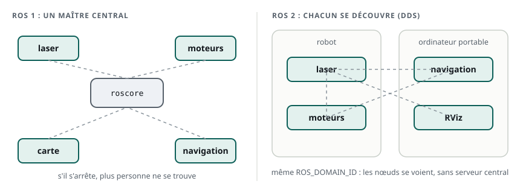
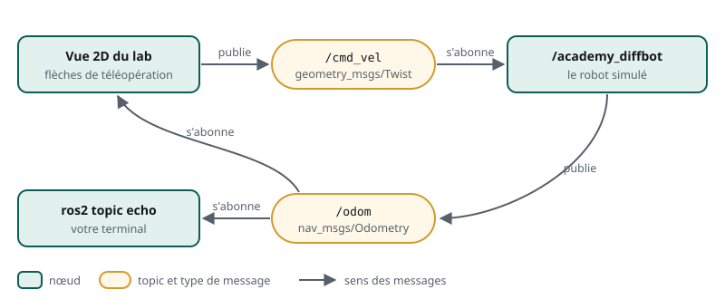
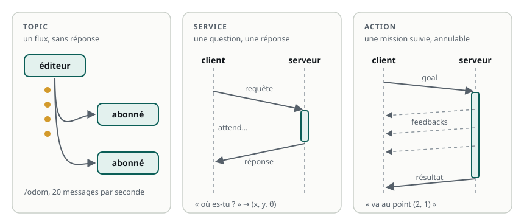

# Pourquoi ROS 2 ?

> **La situation.** Le robot de livraison a un laser, deux moteurs, une centrale inertielle, un calcul de position, bientôt une carte et un planificateur. Chacun de ces programmes est écrit par une personne différente, parfois dans un langage différent, et certains tournent sur un ordinateur portable plutôt que sur le robot. Comment les faire travailler ensemble sans tout réécrire à chaque changement ? C'est la question à laquelle répond ROS 2.

**Dans ce module, vous allez :**

- comprendre ce qu'est un **middleware** et pourquoi ROS 2 a remplacé ROS 1 ;
- comprendre l'**architecture distribuée** de ROS 2 ;
- définir précisément les mots que vous utiliserez dans tout le parcours : **nœud**, **graphe**, **topic**, **service**, **action**, **interface** ;
- les observer sur le robot simulé, avec les commandes `ros2`.

C'est un module de cours : il se termine par un QCM. Le module suivant vous fera créer votre premier package.

## L'essentiel en théorie

- ROS 2 est un **middleware** : une couche logicielle qui fait communiquer les programmes d'un robot, et qui fournit outils et bibliothèques prêtes à l'emploi.
- Un robot ROS 2 est découpé en **nœuds**, de petits programmes à une seule responsabilité. L'ensemble des nœuds et de leurs canaux forme le **graphe ROS**.
- Les nœuds se découvrent seuls grâce à **DDS**, sans serveur central : l'architecture est **distribuée**, sur une ou plusieurs machines.
- Ils communiquent de trois façons : **topics** (flux continu), **services** (question-réponse), **actions** (mission longue, suivie et annulable).
- Tout ce qui circule a un **type**, décrit par une **interface** (`.msg`, `.srv`, `.action`), commune à Python et à C++.

## 1. Pourquoi un middleware ?

Imaginez le logiciel du robot sans ROS. Le programme du laser doit envoyer ses mesures au programme d'évitement d'obstacles ; celui-ci doit parler au contrôleur des moteurs, qui doit renvoyer la position au planificateur… Chaque paire de programmes invente sa propre façon d'échanger : un format de données, un port réseau, un protocole. Avec dix programmes, il y a des dizaines de liaisons à écrire, à tester et à maintenir. Remplacer le laser par un autre modèle casse tout ce qui en dépendait.

Un **middleware** (« logiciel du milieu ») règle ce problème une fois pour toutes. Il se place entre le système d'exploitation et vos programmes, et leur offre :

- une **façon standard de communiquer** : chaque programme publie ce qu'il produit et lit ce dont il a besoin, sans savoir qui est à l'autre bout ;
- des **types de données communs** : une position, une image, un scan laser s'écrivent partout de la même manière ;
- des **outils** : inspecter ce qui circule, enregistrer et rejouer les données, visualiser, simuler ;
- un **écosystème** : des milliers de packages prêts à l'emploi (pilotes de capteurs, localisation, navigation, bras manipulateurs) qui parlent déjà ce langage commun.

C'est la vraie force de ROS : ne pas réinventer la roue. Un laboratoire ou une entreprise assemble des briques existantes et se concentre sur ce qui fait la différence de son robot.

## 2. De ROS 1 à ROS 2

ROS 1, né en 2007, a été pensé pour la recherche : un robot, un réseau de laboratoire fiable, des programmes en confiance. Avec les robots industriels, les flottes et les véhicules autonomes, ces hypothèses ne tenaient plus. Plutôt que de rafistoler ROS 1, la communauté a écrit **ROS 2** (première version stable en 2017) :

| | ROS 1 | ROS 2 |
|---|---|---|
| Découverte des programmes | un serveur central, `roscore` | automatique, sans serveur (DDS) |
| Si le serveur central tombe | plus aucun programme ne se trouve | sans objet |
| Réseaux peu fiables, Wi-Fi | mal supportés | qualité de service réglable (QoS) |
| Temps réel, embarqué | non prévu | pris en compte dans la conception |
| Sécurité | aucune | chiffrement et authentification possibles (SROS2) |
| Plusieurs robots | délicat | naturel (domaines, espaces de noms) |
| Systèmes | Linux | Linux, Windows, macOS |

ROS 1 n'est plus maintenu depuis mai 2025 : tout nouveau projet démarre en ROS 2. Les concepts, eux, sont restés les mêmes, et c'est ce qui rend ROS 2 accessible.

## 3. Une architecture distribuée

Dans ROS 2, il n'y a **pas de chef d'orchestre**. Chaque programme annonce sa présence sur le réseau, et ceux qui s'intéressent aux mêmes données se trouvent et se parlent directement. Ce mécanisme de découverte et d'échange est confié à **DDS** (*Data Distribution Service*), un standard industriel utilisé aussi dans l'aéronautique, la défense ou la finance.



Conséquences pratiques :

- **plusieurs machines** : un nœud qui tourne sur votre ordinateur portable voit ceux du robot, s'ils sont sur le même réseau ;
- **domaines** : la variable `ROS_DOMAIN_ID` (0 par défaut) sépare des groupes de nœuds qui partagent un réseau. Deux robots dans le même entrepôt, avec deux domaines différents, ne se mélangent pas ;
- **dans votre lab**, la découverte est limitée à votre machine (`ROS_AUTOMATIC_DISCOVERY_RANGE=LOCALHOST`) : vous ne voyez pas les nœuds des autres étudiants.

## 4. Les nœuds

Un **nœud** est un programme ROS qui remplit **une seule tâche** : lire le laser, commander les moteurs, estimer la position, planifier un trajet. Le logiciel d'un robot réel en compte des dizaines.

Ce découpage a trois avantages : chaque nœud est simple à écrire et à tester ; un nœud qui plante n'emporte pas tout le robot ; et un nœud se remplace sans toucher aux autres. Un simulateur peut ainsi prendre la place du vrai robot, tant qu'il parle sur les mêmes canaux : c'est ce que fait votre lab.

À retenir sur les nœuds :

- un nœud a un **nom**, unique dans le graphe : `/academy_diffbot` ;
- il peut être rangé dans un **espace de noms** : `/robot1/academy_diffbot` et `/robot2/academy_diffbot` coexistent ;
- un nœud s'écrit en **Python** (`rclpy`) ou en **C++** (`rclcpp`) ; les deux se comprennent ;
- un nœud vit dans un **exécutable**, lui-même fourni par un **package**. On le lance avec `ros2 run <package> <exécutable>`. Un même exécutable peut contenir plusieurs nœuds.

**Atelier :** démarrez le robot simulé, puis, dans un deuxième terminal (bouton **+**), listez et inspectez ses nœuds.

```bash
academy-diffbot
```

```bash
ros2 node list
ros2 node info /academy_diffbot
```

`ros2 node info` montre tout ce que le nœud fait : ce qu'il écoute (*Subscribers*), ce qu'il publie (*Publishers*), ses services et ses actions.

## 5. Le graphe ROS

L'ensemble des nœuds en cours d'exécution et des canaux qui les relient forme le **graphe ROS**. C'est la carte de votre robot à un instant donné.



Le graphe change en permanence : lancer un nœud y ajoute une boîte et ses liaisons, l'arrêter les retire. Sur un poste de développement, l'outil graphique `rqt_graph` le dessine automatiquement. Dans le lab, les commandes `ros2 node list`, `ros2 topic list` et `ros2 topic info` donnent la même information.

## 6. Trois façons de communiquer



| | Topic | Service | Action |
|---|---|---|---|
| Modèle | publication / abonnement | requête / réponse | goal, feedbacks, résultat |
| Déroulement | flux continu, sans réponse | une question, une réponse | tâche longue, suivie, annulable |
| Qui parle à qui | N éditeurs, N abonnés | des clients, un serveur | des clients, un serveur |
| Exemple | `/odom`, `/cmd_vel` | « où es-tu ? » | « va au point (2, 1) » |
| Interface | `.msg` | `.srv` | `.action` |

Règle pratique : un flux de données → topic ; une question rapide → service ; une mission qui dure → action.

## 7. Les topics

Un **topic** est un canal nommé qui transporte des messages d'un seul type. Des nœuds **publient** (*publishers*), d'autres **s'abonnent** (*subscribers*). La communication est **asynchrone** et **anonyme** : l'éditeur ne sait pas qui lit, ni même si quelqu'un lit ; l'abonné ne sait pas qui écrit. C'est le canal des capteurs, des commandes de vitesse, de la position.

Commandes utiles :

- `ros2 topic list -t` : les topics actifs et leur type ;
- `ros2 topic info <topic>` : le type, le nombre d'éditeurs et d'abonnés ;
- `ros2 topic echo <topic>` : les messages, en direct ;
- `ros2 topic hz <topic>` : la fréquence ;
- `ros2 topic pub <topic> <type> 'données'` : publier soi-même.

**Atelier :** le robot tourne toujours dans le premier terminal.

```bash
ros2 topic list -t
ros2 topic info /cmd_vel
ros2 topic echo /odom --once
ros2 topic hz /odom
```

Arrêtez `hz` avec **Ctrl+C**, puis donnez un ordre au robot et regardez la **vue 2D** :

```bash
ros2 topic pub -r 10 /cmd_vel geometry_msgs/msg/Twist "{linear: {x: 0.3}, angular: {z: 0.4}}"
```

Vous retrouvez les vitesses `v` et `ω` du module « Le robot mobile », dans le message `Twist`.

## 8. Les services

Un **service** fonctionne par **requête / réponse** : un client pose une question, un serveur répond, une fois. Rien ne circule tant que personne ne demande. C'est le bon outil pour un état ponctuel (« quelle est ta position ? ») ou une commande courte (« recalibre ce capteur »).

Commandes utiles :

- `ros2 service list -t` : les services et leurs types ;
- `ros2 interface show <type>` : la structure de la requête et de la réponse ;
- `ros2 service call <service> <type> 'requête'` : appeler le service.

**Atelier :** un serveur d'exemple additionne deux entiers. Lancez-le dans un troisième terminal :

```bash
ros2 run demo_nodes_py add_two_ints_server
```

```bash
ros2 service list -t
ros2 interface show example_interfaces/srv/AddTwoInts
ros2 service call /add_two_ints example_interfaces/srv/AddTwoInts "{a: 2, b: 40}"
```

## 9. Les actions

Une **action** sert à confier une **tâche longue** : livrer un colis à l'autre bout de l'entrepôt prend du temps, on veut suivre l'avancement et pouvoir annuler. Une action comporte trois messages : le **goal** (l'objectif), des **feedbacks** successifs (l'avancement) et le **résultat**. Le client peut annuler un goal en cours.

Commandes utiles :

- `ros2 action list -t` : les actions et leurs types ;
- `ros2 action info <action>` : ses clients et ses serveurs ;
- `ros2 action send_goal <action> <type> 'goal' --feedback` : envoyer un goal et suivre les feedbacks ; **Ctrl+C** l'annule.

**Atelier :** un serveur d'exemple calcule la suite de Fibonacci, un terme par seconde.

```bash
ros2 run action_tutorials_py fibonacci_action_server
```

```bash
ros2 action list -t
ros2 action send_goal --feedback /fibonacci action_tutorials_interfaces/action/Fibonacci "{order: 8}"
```

Chaque feedback ajoute un terme ; le résultat arrive à la fin. Relancez avec `{order: 20}`, puis interrompez avec **Ctrl+C** : le goal est annulé.

## 10. Les interfaces

Tout ce qui circule a un **type**, défini par une **interface** :

| Fichier | Pour | Contenu |
|---|---|---|
| `.msg` | un topic | une liste de champs typés |
| `.srv` | un service | la requête, `---`, la réponse |
| `.action` | une action | le goal, `---`, le résultat, `---`, le feedback |

Un type se nomme `package/genre/Nom` : `geometry_msgs/msg/Twist`, `example_interfaces/srv/AddTwoInts`. À partir d'une interface, ROS 2 **génère le code** correspondant en Python et en C++ : c'est ce qui permet à un nœud Python et un nœud C++ de se comprendre.

Quelques packages d'interfaces que vous croiserez partout :

- `std_msgs` : types simples (`String`, `Bool`, `Float64`…) ;
- `geometry_msgs` : positions, orientations, vitesses (`Pose`, `Twist`…) ;
- `sensor_msgs` : capteurs (`LaserScan`, `Image`, `Imu`…) ;
- `nav_msgs` : navigation (`Odometry`, `Path`, `OccupancyGrid`…).

```bash
ros2 interface show geometry_msgs/msg/Twist
ros2 interface list | grep sensor_msgs
```

Et quand aucun type existant ne convient, on écrit le sien : vous le ferez pour le service `get_pose` du robot.

## 11. Les paramètres, en un mot

Un nœud a souvent des réglages : vitesse maximale, fréquence de publication, nom d'un repère. ROS 2 les gère comme des **paramètres** : des valeurs nommées, propres à chaque nœud, fixées au lancement et parfois modifiables pendant qu'il tourne (`ros2 param list`, `ros2 param get`). Un module entier leur est consacré plus loin.

## 12. À retenir

| Mot | Définition | Commande |
|---|---|---|
| Middleware | couche qui fait communiquer les programmes, avec outils et écosystème | — |
| DDS | le standard de communication sous ROS 2 : découverte sans serveur central | `ROS_DOMAIN_ID` |
| Nœud | programme à une seule responsabilité, nommé, dans un package | `ros2 node list`, `ros2 node info` |
| Graphe ROS | les nœuds en cours et leurs canaux | `rqt_graph` (hors lab) |
| Topic | flux de messages typés, publication / abonnement | `ros2 topic echo`, `pub`, `hz` |
| Service | requête / réponse, une fois | `ros2 service call` |
| Action | mission longue : goal, feedbacks, résultat, annulation | `ros2 action send_goal --feedback` |
| Interface | le type de ce qui circule : `.msg`, `.srv`, `.action` | `ros2 interface show` |
| Paramètre | réglage nommé d'un nœud | `ros2 param list` |

**Et maintenant ?** Vous savez lire un robot ROS 2. Le module suivant vous apprend à organiser votre propre code : workspace, packages et exécutables.
