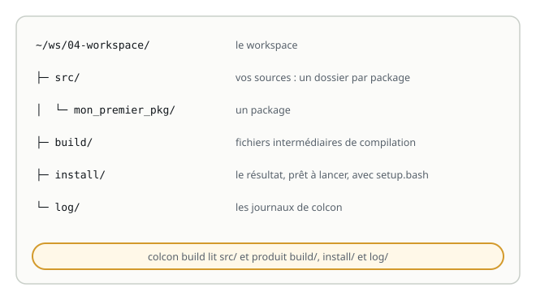
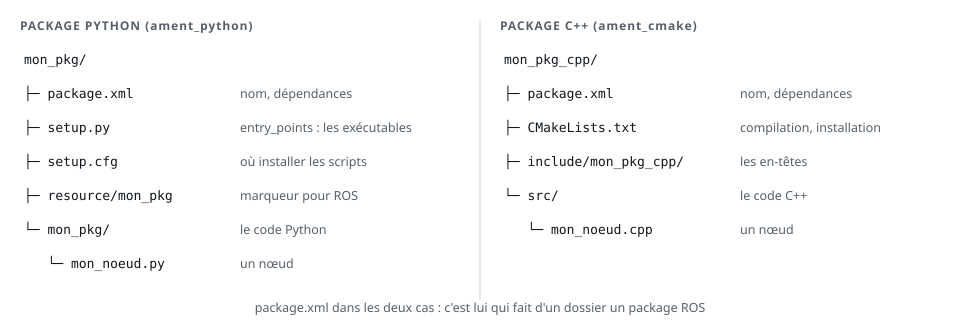
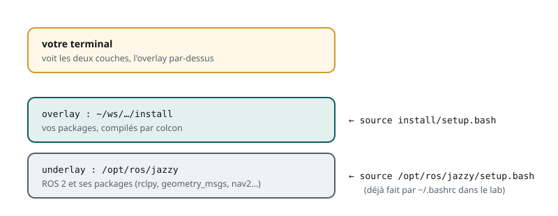

# Organiser son code

> **La situation.** L'équipe du robot de livraison partage son code : chacun ajoute ses nœuds, d'autres les compilent et les lancent sur le robot. Pour que cela fonctionne, ROS 2 impose une organisation précise : des **packages**, rangés dans un **workspace**, compilés avec **colcon**. Avant d'écrire le premier nœud du robot, vous allez préparer cet espace de travail.

**Dans ce module, vous allez :**

- comprendre ce que sont un **workspace**, un **package** et un **exécutable**, et comment ils s'emboîtent ;
- lire les fichiers qui décrivent un package : `package.xml`, `setup.py` ou `CMakeLists.txt` ;
- créer, compiler et lancer votre premier package ;
- comprendre `source install/setup.bash` et les erreurs les plus fréquentes.

## L'essentiel en théorie

- Un **workspace** est le dossier de travail d'un projet : les sources dans `src/`, et, après compilation, `build/`, `install/` et `log/`.
- Un **package** est l'unité de code de ROS 2 : un dossier avec un `package.xml` (nom, dépendances) et, selon le langage, un `setup.py` (Python, `ament_python`) ou un `CMakeLists.txt` (C++, `ament_cmake`).
- Un package fournit des **exécutables** ; chacun lance un ou plusieurs **nœuds**. Un exécutable n'existe que s'il est **déclaré** dans le package.
- **colcon** compile tous les packages de `src/` et installe le résultat dans `install/`.
- `source install/setup.bash` superpose votre workspace (l'**overlay**) à l'installation de ROS (l'**underlay**) : sans lui, ROS ne trouve pas vos packages.

## 1. Le workspace

Un **workspace** est un dossier qui regroupe les packages d'un projet. Sa structure est toujours la même :



- `src/` : **vos sources**, un sous-dossier par package. C'est le seul dossier que vous modifiez à la main ;
- `build/` : les fichiers intermédiaires de la compilation ;
- `install/` : le **résultat**, prêt à être lancé, avec le script `setup.bash` ;
- `log/` : les journaux de compilation, utiles quand quelque chose échoue.

`build/`, `install/` et `log/` sont **produits** par la compilation : on peut les supprimer, une nouvelle compilation les recrée. On ne les partage pas (on ne les met pas dans Git), contrairement à `src/`.

Dans le lab, chaque module a son workspace : `~/ws/04-workspace` pour celui-ci.

## 2. Le package

Un **package** est l'unité d'organisation, de compilation et de partage du code ROS 2. Il regroupe tout ce qu'il faut pour une fonctionnalité : des nœuds, leurs fichiers de configuration et de lancement, éventuellement des interfaces. Un robot complet en compte des dizaines ; les packages installés avec ROS (`rclpy`, `geometry_msgs`, `nav2_bringup`…) suivent exactement la même organisation que les vôtres.

Deux types de packages, selon le langage :



| | Python | C++ |
|---|---|---|
| Type de compilation | `ament_python` | `ament_cmake` |
| Description de l'installation | `setup.py` (et `setup.cfg`) | `CMakeLists.txt` |
| Code | `mon_pkg/mon_pkg/*.py` | `src/*.cpp`, `include/<pkg>/*.hpp` |
| Compilation | rien à compiler, juste installer | compilation par le compilateur C++ |

Conventions : un nom de package est en **minuscules**, avec des **tirets bas** (`mon_premier_pkg`, `my_robot_description`) ; il est unique dans votre workspace. Les packages d'interfaces (`.msg`, `.srv`, `.action`) sont toujours de type `ament_cmake`, même dans un projet Python.

## 3. Le fichier `package.xml`

Chaque package a un `package.xml` : sa **carte d'identité**. C'est lui qui fait d'un dossier un package ROS.

```xml
<?xml version="1.0"?>
<package format="3">
  <name>mon_premier_pkg</name>
  <version>0.0.0</version>
  <description>Le premier package du robot de livraison</description>
  <maintainer email="vous@exemple.fr">vous</maintainer>
  <license>Apache-2.0</license>

  <depend>rclpy</depend>
  <depend>geometry_msgs</depend>

  <export>
    <build_type>ament_python</build_type>
  </export>
</package>
```

Les lignes `<depend>` déclarent les **dépendances** : les autres packages dont celui-ci a besoin. colcon s'en sert pour compiler les packages dans le bon ordre, et l'outil `rosdep` pour installer ce qui manque. Une dépendance oubliée fonctionne parfois par chance sur votre machine… et casse sur celle d'un collègue : déclarez tout ce que vous importez.

## 4. Les exécutables

Trois niveaux à ne pas confondre :

- le **package** regroupe le code : `mon_premier_pkg` ;
- un **exécutable** est un programme que le package installe : `mon_noeud` ;
- un **nœud** est ce que l'exécutable crée en tournant : `/mon_noeud` dans le graphe.

On lance un exécutable avec `ros2 run <package> <exécutable>`. Mais un fichier de code ne devient pas exécutable tout seul : le package doit le **déclarer**.

En Python, dans `setup.py`, la liste `console_scripts` associe un nom d'exécutable à une fonction :

```python
entry_points={
    'console_scripts': [
        'mon_noeud = mon_premier_pkg.mon_noeud:main',
    ],
},
```

En C++, dans `CMakeLists.txt`, on compile l'exécutable puis on l'installe :

```cmake
add_executable(mon_noeud src/mon_noeud.cpp)
ament_target_dependencies(mon_noeud rclcpp)
install(TARGETS mon_noeud DESTINATION lib/${PROJECT_NAME})
```

`ros2 pkg executables <package>` liste les exécutables effectivement installés : c'est la première commande à taper quand `ros2 run` ne trouve pas un nœud.

## 5. Créer un package

`ros2 pkg create` génère un package complet, avec tous ses fichiers :

- `--build-type ament_python` ou `ament_cmake` : le langage ;
- `--dependencies rclpy geometry_msgs` : les dépendances, ajoutées à `package.xml` ;
- `--node-name mon_noeud` : un premier nœud d'exemple, **déjà déclaré** comme exécutable.

**Atelier :** créez le workspace et votre premier package Python.

```bash
mkdir -p ~/ws/04-workspace/src
cd ~/ws/04-workspace/src
ros2 pkg create mon_premier_pkg --build-type ament_python --node-name mon_noeud
```

Ouvrez `src/mon_premier_pkg` dans l'arborescence des fichiers du lab : retrouvez `package.xml`, `setup.py` et sa ligne `console_scripts`, et le code du nœud dans `mon_premier_pkg/mon_noeud.py`.

## 6. Compiler avec colcon

On compile **toujours depuis la racine du workspace**, jamais depuis `src/` :

```bash
cd ~/ws/04-workspace
colcon build --symlink-install
ls
```

`build/`, `install/` et `log/` sont apparus. Quelques options utiles :

- `--symlink-install` : pour les fichiers Python et de configuration, `install/` pointe vers vos sources au lieu de les copier. Une modification d'un fichier `.py` est prise en compte sans recompiler (mais un **nouvel** exécutable demande toujours un `colcon build`) ;
- `--packages-select mon_premier_pkg` : ne compiler que ce package ;
- en C++, toute modification du code demande un nouveau `colcon build`.

## 7. Underlay et overlay

Compiler ne suffit pas : il faut dire au terminal où trouver vos packages. Votre terminal connaît déjà ROS 2, installé dans `/opt/ros/jazzy` : c'est l'**underlay**. Votre workspace compilé se superpose à lui : c'est un **overlay**.



```bash
source install/setup.bash
```

Ce `source` (voir le module Linux) ajoute votre workspace aux variables d'environnement **du terminal courant**. Trois conséquences :

- il faut le refaire dans **chaque nouveau terminal** ;
- il faut le refaire après avoir **ajouté un package** (pour un exécutable ajouté à un package existant, un `colcon build` suffit) ;
- si un package porte le même nom dans l'overlay et dans l'underlay, c'est celui de l'overlay qui gagne : c'est ainsi qu'on teste sa propre version modifiée d'un package de ROS.

## 8. Lancer : `ros2 run`

```bash
ros2 pkg executables mon_premier_pkg
ros2 run mon_premier_pkg mon_noeud
```

Le nœud d'exemple affiche un message, puis s'arrête. Quelques commandes pour s'y retrouver :

- `ros2 pkg list` : tous les packages visibles (underlay et overlay) ;
- `ros2 pkg prefix mon_premier_pkg` : où le package est installé ;
- `ros2 pkg executables mon_premier_pkg` : ses exécutables.

## 9. Les erreurs classiques

| Message | Cause probable | Remède |
|---|---|---|
| `Package 'mon_pkg' not found` | le workspace n'est pas sourcé dans ce terminal | `source install/setup.bash` |
| `No executable found` | l'exécutable n'est pas déclaré (`console_scripts`, `install(TARGETS …)`) | le déclarer, puis `colcon build` |
| un dossier `build/` apparaît dans `src/` | `colcon build` lancé depuis `src/` | supprimer `src/build`, `src/install`, `src/log`, recompiler depuis la racine |
| `ModuleNotFoundError` au lancement | dépendance Python absente ou non déclarée | l'ajouter à `package.xml` (et l'installer) |
| une modification C++ n'a aucun effet | pas recompilé | `colcon build`, puis relancer |

L'exercice de ce module vous met face à l'une d'elles, sur un vrai package.

## 10. Pour plus tard : installer ROS 2 chez vous

Dans ce parcours, le lab suffit. Pour travailler un jour sur votre propre machine ou sur un vrai robot, l'installation se fait sous Ubuntu 24.04 par paquets Debian, en suivant la [procédure officielle](https://docs.ros.org/en/jazzy/Installation/Ubuntu-Install-Debs.html) : ajouter le dépôt ROS 2 et sa clé, puis installer l'environnement complet (avec RViz et les tutoriels) :

```text
sudo apt install ros-jazzy-desktop
```

Puis, dans chaque terminal (ou une fois pour toutes, à la fin de `~/.bashrc`) :

```text
source /opt/ros/jazzy/setup.bash
```

Pour chercher un package existant, consultez [index.ros.org](https://index.ros.org/) ; pour une question technique, [Robotics Stack Exchange](https://robotics.stackexchange.com/).

## 11. À retenir

| Notion | En une phrase | Commande |
|---|---|---|
| Workspace | `src/` pour les sources ; `build/`, `install/`, `log/` produits par la compilation | `mkdir -p ~/ws/projet/src` |
| Package | unité de code : `package.xml` + `setup.py` (Python) ou `CMakeLists.txt` (C++) | `ros2 pkg create` |
| `package.xml` | nom, version, dépendances, type de compilation | — |
| Exécutable | programme déclaré par le package, qui lance un ou des nœuds | `ros2 pkg executables` |
| Compilation | depuis la racine du workspace | `colcon build --symlink-install` |
| Overlay | votre workspace superposé à ROS, dans ce terminal | `source install/setup.bash` |
| Lancement | un exécutable d'un package | `ros2 run <package> <exécutable>` |

**Et maintenant ?** L'exercice vous met face à un package qui compile… mais dont le nœud refuse de démarrer. Ensuite, vous écrirez le premier nœud du robot de livraison.
