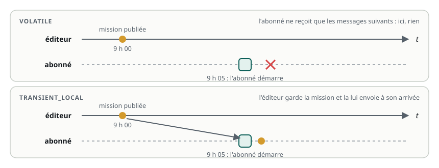
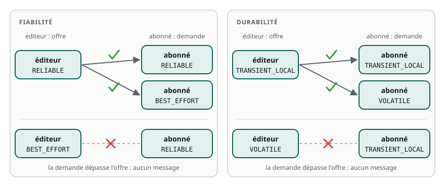

# La qualité de service (QoS)

> **La situation.** Le robot de livraison quitte le laboratoire pour l'entrepôt. Le poste de supervision le suit par le Wi-Fi, qui perd des paquets dès qu'il passe derrière une étagère. Deux surprises le premier jour : un moniteur démarré après le robot n'a jamais appris sa mission, et le superviseur ne reçoit aucune mesure du nouveau capteur de batterie. Aucune erreur, aucun plantage. Les deux ont la même cause : la **qualité de service**.

**Dans ce module, vous allez :**

- comprendre les réglages de QoS d'un topic : **fiabilité**, **durabilité**, **historique** ;
- utiliser les profils prêts à l'emploi, dont celui des capteurs ;
- garder la dernière valeur d'un topic pour les nœuds qui arrivent en retard ;
- reconnaître et corriger deux réglages **incompatibles**.

C'est un module bonus : il ne compte pas dans la note finale ni dans le certificat.

## L'essentiel en théorie

- La **QoS** (*Quality of Service*) règle **comment** les messages d'un topic voyagent : faut-il tout livrer, garder combien de messages, les conserver pour les retardataires ?
- La **fiabilité** : `RELIABLE` renvoie un message perdu jusqu'à ce qu'il arrive ; `BEST_EFFORT` l'abandonne, et passe au suivant.
- La **durabilité** : `VOLATILE` ne livre que les messages publiés après l'arrivée de l'abonné ; `TRANSIENT_LOCAL` garde les derniers pour les abonnés qui arrivent plus tard.
- L'**historique** : combien de messages garder en file (`KEEP_LAST` avec une profondeur, ou `KEEP_ALL`). C'est le `10` de `create_publisher(…, 10)`.
- L'éditeur **offre** une qualité, l'abonné en **demande** une : ils ne communiquent que si l'offre est au moins aussi bonne que la demande. Sinon, **aucun message ne passe**, avec un simple avertissement.

## 1. Les réglages d'un topic

Jusqu'ici, vous avez écrit `create_publisher(Twist, 'cmd_vel', 10)` sans vous poser de questions. Ce `10` est un raccourci pour le **profil par défaut** : fiable, volatile, 10 messages en file. Il convient à la plupart des usages, mais pas à tous. Un profil de QoS se compose de plusieurs **politiques** :

| Politique | Valeurs | Ce qu'elle règle |
|---|---|---|
| Historique (*history*) | `KEEP_LAST` + profondeur (*depth*), `KEEP_ALL` | combien de messages attendent en file, côté éditeur et côté abonné |
| Fiabilité (*reliability*) | `RELIABLE`, `BEST_EFFORT` | un message perdu est-il renvoyé ? |
| Durabilité (*durability*) | `VOLATILE`, `TRANSIENT_LOCAL` | un abonné qui arrive en retard reçoit-il les derniers messages ? |
| Échéance (*deadline*) | une durée | l'intervalle maximal attendu entre deux messages |
| Durée de vie (*lifespan*) | une durée | l'âge au-delà duquel un message n'est plus livré |
| Vivacité (*liveliness*) | `AUTOMATIC`, `MANUAL_BY_TOPIC` + délai | comment savoir qu'un éditeur est toujours là |

Les trois premières suffisent dans la grande majorité des cas ; les trois autres servent à surveiller un flux (un capteur qui se tait, une commande trop ancienne).

### La fiabilité

Avec `RELIABLE`, chaque message est acquitté par l'abonné ; l'éditeur renvoie ceux qui se sont perdus. Rien ne manque, mais sur un réseau dégradé, les renvois prennent du temps et la file se remplit : les messages arrivent **en retard**.

Avec `BEST_EFFORT`, un message perdu est perdu. Pour un laser qui publie 10 fois par seconde, c'est le bon choix : le scan perdu sera remplacé dans 100 ms par un plus récent, et mieux vaut un scan récent qu'un scan complet mais vieux d'une seconde.

### La durabilité

Avec `VOLATILE`, un abonné ne reçoit que ce qui est publié **après** son arrivée. Avec `TRANSIENT_LOCAL`, l'éditeur garde ses derniers messages (autant que la profondeur d'historique) et les envoie à chaque nouvel abonné, à condition que celui-ci les demande aussi.

C'est indispensable pour une information publiée **une seule fois** ou rarement : la description du robot (`/robot_description`), les transformations fixes (`/tf_static`), une carte (`/map`)… ou la mission du jour.



### L'historique

La profondeur d'historique règle la file d'attente. Un abonné lent, avec `KEEP_LAST` et une profondeur 1, ne traite que le message le plus récent : c'est souvent ce qu'on veut pour une commande ou une position. Une profondeur plus grande lisse les à-coups du réseau, au prix de la mémoire et d'un retard possible. `KEEP_ALL` ne jette rien : à réserver aux cas où chaque message compte, et où le débit est faible.

## 2. Les profils prêts à l'emploi

`rclpy.qos` fournit des profils qui couvrent les cas courants :

| Profil | Fiabilité | Durabilité | Historique | Pour |
|---|---|---|---|---|
| par défaut (le `10`) | `RELIABLE` | `VOLATILE` | `KEEP_LAST` 10 | commandes, états, la plupart des topics |
| `qos_profile_sensor_data` | `BEST_EFFORT` | `VOLATILE` | `KEEP_LAST` 5 | mesures de capteurs à haute fréquence |
| `qos_profile_services_default` | `RELIABLE` | `VOLATILE` | `KEEP_LAST` 10 | services |
| `qos_profile_parameters` | `RELIABLE` | `VOLATILE` | `KEEP_LAST` 1000 | paramètres |

Et pour un réglage sur mesure, un `QoSProfile` :

```python
from rclpy.qos import DurabilityPolicy, QoSProfile, ReliabilityPolicy, qos_profile_sensor_data

# un capteur : le profil tout prêt
self.create_subscription(LaserScan, 'scan', self.on_scan, qos_profile_sensor_data)

# une information publiée une fois, gardée pour les retardataires
latched = QoSProfile(depth=1, reliability=ReliabilityPolicy.RELIABLE,
                     durability=DurabilityPolicy.TRANSIENT_LOCAL)
self.create_publisher(String, 'mission', latched)
```

Les pilotes de capteurs (lasers, caméras, centrales inertielles) publient presque toujours avec `qos_profile_sensor_data`. Le réflexe à prendre : **s'abonner à un capteur avec le même profil**.

## 3. Offre et demande : la compatibilité

Côté éditeur, la QoS est une **offre** (« je livre au moins ceci ») ; côté abonné, une **demande** (« j'ai besoin d'au moins ceci »). DDS ne relie les deux que si l'offre satisfait la demande :



| Éditeur (offre) | Abonné (demande) | Résultat |
|---|---|---|
| `RELIABLE` | `RELIABLE` ou `BEST_EFFORT` | ✅ |
| `BEST_EFFORT` | `BEST_EFFORT` | ✅ |
| `BEST_EFFORT` | `RELIABLE` | ❌ aucun message |
| `TRANSIENT_LOCAL` | `TRANSIENT_LOCAL` | ✅ avec les derniers messages |
| `TRANSIENT_LOCAL` | `VOLATILE` | ✅ mais sans les messages passés |
| `VOLATILE` | `TRANSIENT_LOCAL` | ❌ aucun message |

En cas d'incompatibilité, rien ne plante : chaque côté affiche **un seul avertissement**, au moment où il découvre l'autre, puis se tait.

```text
[WARN] [superviseur_node]: New publisher discovered on topic '/battery_state', offering incompatible QoS.
No messages will be received from it. Last incompatible policy: RELIABILITY
```

Si vous l'avez manqué dans le flot des journaux, `ros2 topic info -v` montre la QoS de chaque éditeur et de chaque abonné d'un topic :

```bash
ros2 topic info -v /battery_state
# Endpoint type: PUBLISHER      ... Reliability: BEST_EFFORT
# Endpoint type: SUBSCRIPTION   ... Reliability: RELIABLE      ← la demande dépasse l'offre
```

`ros2 topic echo` choisit automatiquement une QoS compatible avec les éditeurs qu'il trouve : il reçoit les messages même quand votre nœud n'y arrive pas. C'est un piège classique (« `echo` les voit, mais pas mon nœud ! ») et un bon indice : le problème n'est pas le topic, c'est la QoS de l'abonné.

## 4. Pratique : la mission et le moniteur

Votre workspace `~/ws/12-qos` reprend le robot du module Paramètres (et son fichier launch). On y ajoute deux nœuds : `mission_node` annonce la mission du jour **une seule fois**, au démarrage ; `moniteur_node`, le poste de supervision, affiche la mission et suit la position du robot.

```python fichier=src/my_pkg/my_pkg/mission_node.py
import rclpy
from rclpy.node import Node
from rclpy.qos import DurabilityPolicy, QoSProfile, ReliabilityPolicy
from std_msgs.msg import String


class MissionNode(Node):
    """Annonce la mission du jour, une seule fois, au démarrage."""

    def __init__(self):
        super().__init__('mission_node')
        self.declare_parameter('mission', 'livrer le colis 42 au quai B')
        # TRANSIENT_LOCAL : le dernier message est gardé pour les abonnés qui arrivent plus tard
        qos = QoSProfile(depth=1, reliability=ReliabilityPolicy.RELIABLE,
                         durability=DurabilityPolicy.TRANSIENT_LOCAL)
        self.pub = self.create_publisher(String, 'mission', qos)
        mission = self.get_parameter('mission').value
        self.pub.publish(String(data=mission))
        self.get_logger().info(f'Mission publiée : {mission}')


def main(args=None):
    rclpy.init(args=args)
    node = MissionNode()
    try:
        rclpy.spin(node)  # le nœud reste en vie pour servir les retardataires
    except KeyboardInterrupt:
        pass
    finally:
        node.destroy_node()
        rclpy.try_shutdown()


if __name__ == '__main__':
    main()
```

```python fichier=src/my_pkg/my_pkg/moniteur_node.py
import rclpy
from nav_msgs.msg import Odometry
from rclpy.node import Node
from rclpy.qos import DurabilityPolicy, QoSProfile, qos_profile_sensor_data
from std_msgs.msg import String


class MoniteurNode(Node):
    """Poste de supervision : affiche la mission, puis la position du robot chaque seconde."""

    def __init__(self):
        super().__init__('moniteur_node')
        self.position = None
        # La mission : on demande aussi TRANSIENT_LOCAL, pour la recevoir même en arrivant après
        mission_qos = QoSProfile(depth=1, durability=DurabilityPolicy.TRANSIENT_LOCAL)
        self.create_subscription(String, 'mission', self.on_mission, mission_qos)
        # L'odométrie : un flux continu, seule la valeur la plus récente compte
        self.create_subscription(Odometry, 'odom', self.on_odom, qos_profile_sensor_data)
        self.create_timer(1.0, self.report)

    def on_mission(self, msg):
        self.get_logger().info(f'Mission reçue : {msg.data}')

    def on_odom(self, msg):
        p = msg.pose.pose.position
        self.position = (p.x, p.y)

    def report(self):
        if self.position is None:
            self.get_logger().info('En attente de la position du robot…')
        else:
            x, y = self.position
            self.get_logger().info(f'Robot en x={x:.2f} m, y={y:.2f} m')


def main(args=None):
    rclpy.init(args=args)
    node = MoniteurNode()
    try:
        rclpy.spin(node)
    except KeyboardInterrupt:
        pass
    finally:
        node.destroy_node()
        rclpy.try_shutdown()


if __name__ == '__main__':
    main()
```

Le moniteur s'abonne à `/odom` en `BEST_EFFORT` alors que `diff_drive_node` publie en `RELIABLE` (le `10`) : l'offre dépasse la demande, c'est compatible. Déclarez les deux exécutables :

```python fichier=src/my_pkg/setup.py
from glob import glob

from setuptools import find_packages, setup

package_name = 'my_pkg'

setup(
    name=package_name,
    version='0.1.0',
    packages=find_packages(exclude=['test']),
    data_files=[
        ('share/ament_index/resource_index/packages', ['resource/' + package_name]),
        ('share/' + package_name, ['package.xml']),
        ('share/' + package_name + '/launch', glob('launch/*.launch.py')),
        ('share/' + package_name + '/config', glob('config/*.yaml')),
    ],
    install_requires=['setuptools'],
    zip_safe=True,
    maintainer='etudiant',
    maintainer_email='etudiant@ros-academy.local',
    description='Robot à conduite différentielle du parcours ROS 2 Fondamentaux',
    license='Apache-2.0',
    entry_points={
        'console_scripts': [
            'diff_drive_node = my_pkg.diff_drive_node:main',
            'mission_node = my_pkg.mission_node:main',
            'moniteur_node = my_pkg.moniteur_node:main',
        ],
    },
)
```

Le `package.xml` du workspace déclare déjà `std_msgs`. Compilez et démarrez le robot, puis la mission :

```bash
cd ~/ws/12-qos
colcon build --symlink-install
source install/setup.bash
ros2 launch my_pkg robot.launch.py
```

```bash
# second terminal
ros2 run my_pkg mission_node
```

Attendez quelques secondes, puis démarrez le moniteur, **après** la publication de la mission :

```bash
# troisième terminal
ros2 run my_pkg moniteur_node
# [INFO] [moniteur_node]: Mission reçue : livrer le colis 42 au quai B
# [INFO] [moniteur_node]: Robot en x=0.00 m, y=0.00 m
```

La mission arrive alors qu'elle a été publiée avant le démarrage du moniteur : c'est `TRANSIENT_LOCAL`. Faites l'expérience inverse avec un abonné volatile :

```bash
ros2 topic echo /mission                              # choisit TRANSIENT_LOCAL : affiche la mission
ros2 topic echo --qos-durability volatile /mission    # n'affiche rien : la mission est déjà passée
ros2 topic info -v /mission                           # la QoS de chaque éditeur et abonné
```

## 5. Pratique : provoquer une incompatibilité

Publiez un message en `BEST_EFFORT` et écoutez-le en exigeant `RELIABLE` :

```bash
ros2 topic pub --qos-reliability best_effort /essai std_msgs/msg/String "{data: bonjour}"
```

```bash
ros2 topic echo --qos-reliability reliable /essai
# [WARN] [...]: New publisher discovered on topic '/essai', offering incompatible QoS.
# No messages will be received from it. Last incompatible policy: RELIABILITY
```

Rien ne s'affiche ensuite. Arrêtez `echo` et relancez-le sans option : il choisit une QoS compatible et affiche `bonjour` chaque seconde.

## 6. Choisir sa QoS

| Le topic transporte… | Fiabilité | Durabilité | Profondeur |
|---|---|---|---|
| des mesures de capteur fréquentes (laser, caméra, IMU) | `BEST_EFFORT` (`qos_profile_sensor_data`) | `VOLATILE` | 1 à 5 |
| des commandes (`/cmd_vel`) | `RELIABLE` | `VOLATILE` | 1 à 10 |
| un état publié rarement (carte, description, mission) | `RELIABLE` | `TRANSIENT_LOCAL` | 1 |
| des événements qu'il ne faut pas perdre (alarmes) | `RELIABLE` | `VOLATILE` | grande, ou `KEEP_ALL` |

Et deux règles pour éviter les surprises :

- **Abonné :** demandez le **minimum** dont vous avez besoin. Un abonné `BEST_EFFORT` reçoit les éditeurs fiables comme les autres.
- **Éditeur d'un état rare :** offrez `TRANSIENT_LOCAL`, sinon un nœud redémarré ne le recevra jamais.

## 7. Rappel

- La QoS d'un topic : **fiabilité** (`RELIABLE` / `BEST_EFFORT`), **durabilité** (`VOLATILE` / `TRANSIENT_LOCAL`), **historique** (profondeur).
- Le `10` habituel = fiable, volatile, 10 messages ; `qos_profile_sensor_data` = best effort, 5 messages.
- L'éditeur offre, l'abonné demande : `BEST_EFFORT` → `RELIABLE` et `VOLATILE` → `TRANSIENT_LOCAL` ne communiquent pas.
- Une incompatibilité ne donne qu'un avertissement ; `ros2 topic info -v` montre la QoS de chaque côté.
- `ros2 topic echo` s'adapte aux éditeurs : qu'il reçoive des messages ne prouve pas que votre nœud les reçoit.

**Et maintenant ?** Le dernier module bonus rassemble les outils pour diagnostiquer un robot qui ne se comporte pas comme prévu : graphe, données, journaux et enregistrements.
