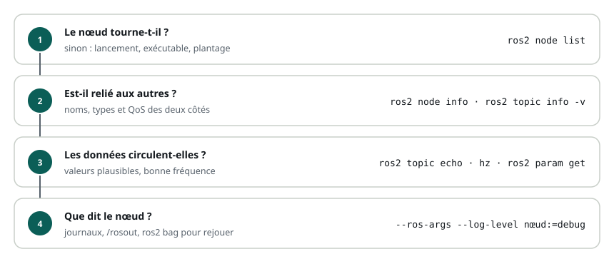

# Les outils de débogage

> **La situation.** Lundi matin, le robot de livraison refuse de partir en tournée. Les nœuds démarrent, aucun message d'erreur, et pourtant il reste immobile. Relire tout le code au hasard prendrait la journée. ROS 2 fournit de quoi interroger le système en marche : qui tourne, qui parle à qui, ce qui circule, ce que disent les nœuds. Encore faut-il savoir dans quel ordre poser les questions.

**Dans ce module, vous allez :**

- suivre une méthode de diagnostic, du graphe jusqu'aux journaux ;
- inspecter les nœuds, les topics et les données qui circulent ;
- régler le niveau des journaux, sans modifier le code ;
- enregistrer et rejouer ce qui s'est passé avec `ros2 bag` ;
- vérifier les repères avec les outils de TF2.

C'est un module bonus : il ne compte pas dans la note finale ni dans le certificat.

## L'essentiel en théorie

- La plupart des pannes ROS ne font **aucune erreur** : un nom de topic mal écrit, un type différent, une QoS incompatible, un paramètre non appliqué. Le système tourne, mais deux pièces ne se parlent pas.
- On diagnostique **du général au particulier** : le **graphe** (qui tourne, qui est relié à qui), puis les **données** (ce qui circule, à quelle fréquence), puis les **journaux** (ce que disent les nœuds).
- Les journaux ont des **niveaux** (`DEBUG`, `INFO`, `WARN`, `ERROR`, `FATAL`) ; on affiche les messages `DEBUG` d'un nœud au lancement, sans toucher au code.
- `ros2 bag` **enregistre** des topics dans un fichier et les **rejoue** : une panne capturée une fois s'étudie autant de fois qu'il faut.
- `ros2 doctor` vérifie l'installation et signale les topics publiés sans abonnés (ou l'inverse).

## 1. Une méthode : quatre questions



1. **Le nœud tourne-t-il ?** `ros2 node list`. S'il manque, le problème est au lancement : exécutable non déclaré, plantage au démarrage (lisez le journal du `launch`).
2. **Est-il relié aux autres ?** `ros2 node info`, `ros2 topic info -v`. Les noms, les **types** et les **QoS** doivent correspondre des deux côtés.
3. **Les données circulent-elles ?** `ros2 topic echo`, `ros2 topic hz`. Les valeurs sont-elles plausibles, la fréquence est-elle celle attendue ?
4. **Que dit le nœud ?** Ses journaux, au besoin en niveau `DEBUG`.

Chaque étape élimine une famille de causes. Les modules précédents en ont fait rencontrer plusieurs : `cmd_vell` au lieu de `cmd_vel` (étape 2, un nom), une QoS incompatible (étape 2, la QoS), un fichier YAML qui vise le mauvais nœud (étape 3 : `ros2 param get` donne la valeur par défaut).

## 2. Le graphe : qui tourne, qui est relié ?

```bash
ros2 node list                        # les nœuds en marche
ros2 node info /diff_drive_node       # ses abonnements, publications, services, actions
ros2 topic list -t                    # tous les topics, avec leur type
ros2 topic info -v /cmd_vel           # éditeurs et abonnés : nœud, type, QoS
ros2 service list -t                  # les services, avec leur type
ros2 action list -t                   # les actions
ros2 param dump /diff_drive_node      # tous les paramètres d'un nœud, en YAML
```

`ros2 node info` répond à la question « ce nœud écoute-t-il bien ce que je crois ? ». `ros2 topic info -v` répond à la question inverse : « qui publie et qui lit ce topic, et sont-ils d'accord ? ». Un topic qui n'a que des éditeurs, ou que des abonnés, est presque toujours un nom mal écrit quelque part.

Sur un poste de travail avec ROS 2 complet (`ros-jazzy-desktop`), `rqt_graph` dessine le graphe et `rqt` regroupe ces outils dans des fenêtres. Le lab n'installe que les outils en ligne de commande, qui donnent les mêmes informations.

## 3. Les données : que circule-t-il ?

```bash
ros2 topic echo /odom --once                         # un seul message
ros2 topic echo /odom --field pose.pose.position     # un seul champ
ros2 topic hz /odom                                  # fréquence de publication
ros2 topic bw /odom                                  # débit, en octets par seconde
ros2 interface show nav_msgs/msg/Odometry            # la structure d'un type
ros2 topic pub --once /cmd_vel geometry_msgs/msg/Twist "{linear: {x: 0.2}}"   # injecter un message
```

`ros2 topic pub` est l'outil inverse : il remplace un nœud, pour tester la suite de la chaîne. Si le robot avance avec une commande publiée à la main mais pas avec celle de votre nœud, le problème est dans votre nœud.

Deux réflexes avec `echo` et `hz` : une fréquence **trop basse** signale un nœud surchargé ou un minuteur mal réglé ; un refus `Cannot echo topic '/cmd_vel', as it contains more than one type` signale deux nœuds qui ne sont pas d'accord sur le type. Attention, ces outils choisissent une QoS compatible avec les éditeurs : qu'ils reçoivent les messages ne prouve pas que votre nœud les reçoit (voir le module bonus sur la QoS).

## 4. Les journaux et leurs niveaux

Les nœuds écrivent leurs journaux avec `get_logger()`, à cinq niveaux :

| Niveau | Pour | Affiché par défaut |
|---|---|---|
| `DEBUG` | le détail du fonctionnement, utile pour chercher une panne | non |
| `INFO` | les étapes normales : démarrage, réglages, mission reçue | oui |
| `WARN` | une situation anormale mais pas bloquante | oui |
| `ERROR` | une opération qui a échoué | oui |
| `FATAL` | le nœud ne peut plus continuer | oui |

Le niveau se choisit **au lancement**, pour tous les nœuds ou pour un seul :

```bash
ros2 run my_pkg patrouille_node --ros-args --log-level debug                    # tout le processus
ros2 run my_pkg patrouille_node --ros-args --log-level patrouille_node:=debug    # un seul nœud
```

Dans un fichier launch : `Node(..., arguments=['--ros-args', '--log-level', 'debug'])`.

Quelques options utiles dans le code :

```python
self.get_logger().debug(f'commande v={v:.2f}')                          # caché par défaut
self.get_logger().warn('Aucune commande reçue', throttle_duration_sec=5.0)  # au plus une fois toutes les 5 s
self.get_logger().info('Premier message reçu', once=True)                 # une seule fois
```

Tous les journaux sont aussi publiés sur le topic `/rosout` (lisible avec `ros2 topic echo /rosout`) et écrits dans `~/.ros/log/`. La variable `RCUTILS_CONSOLE_OUTPUT_FORMAT` règle leur présentation, par exemple `export RCUTILS_CONSOLE_OUTPUT_FORMAT="[{severity}] [{name}] {message}"` pour retirer l'horodatage.

## 5. Enregistrer et rejouer avec `ros2 bag`

Une panne qui survient une fois par heure ne se diagnostique pas en direct. `ros2 bag` enregistre des topics dans un **bag** (un dossier, au format MCAP en Jazzy), qu'on rejoue ensuite :

```bash
ros2 bag record -o tournee /cmd_vel /odom      # Ctrl+C pour arrêter
ros2 bag info tournee                          # durée, topics, nombre de messages
ros2 bag play tournee                          # republie les messages, au même rythme
ros2 bag play tournee --topics /cmd_vel        # seulement certains topics
ros2 bag play tournee --rate 0.5               # au ralenti
```

Rejouer `/odom` permet de tester un nœud de supervision sans robot. Rejouer `/cmd_vel` refait faire au robot exactement le même trajet : idéal pour reproduire un comportement.

## 6. Les repères : TF2

Quand une position est fausse, c'est souvent une transformation qui manque ou qui est mal orientée.

```bash
ros2 run tf2_ros tf2_echo odom laser      # la transformation entre deux repères, en continu
ros2 run tf2_tools view_frames            # l'arbre complet, dans frames_<date>.pdf
```

`tf2_echo` attend tant que la transformation n'existe pas : un message `Invalid frame ID "laser"` qui se répète signifie que personne ne publie ce repère. Le PDF de `view_frames` montre l'arbre, qui publie chaque transformation, et à quelle fréquence.

## 7. Pratique : la patrouille

Votre workspace `~/ws/13-debogage` reprend le robot du module Paramètres. On y ajoute un nœud qui fait patrouiller le robot en carré : tout droit, un quart de tour, et ainsi de suite.

```python fichier=src/my_pkg/my_pkg/patrouille_node.py
import math

import rclpy
from geometry_msgs.msg import Twist
from rclpy.node import Node

TOUT_DROIT = 2.5  # s, à 0,2 m/s : un côté de 50 cm
VIRAGE = 2.0      # s, pour un quart de tour


class PatrouilleNode(Node):
    """Fait patrouiller le robot en carré sur /cmd_vel."""

    def __init__(self):
        super().__init__('patrouille_node')
        self.pub = self.create_publisher(Twist, 'cmd_vel', 10)
        self.debut = self.get_clock().now()
        self.etape = None
        self.create_timer(0.1, self.step)
        self.get_logger().info('Patrouille démarrée')

    def step(self):
        t = (self.get_clock().now() - self.debut).nanoseconds * 1e-9
        cmd = Twist()
        if t % (TOUT_DROIT + VIRAGE) < TOUT_DROIT:
            etape = 'tout droit'
            cmd.linear.x = 0.2
        else:
            etape = 'virage'
            cmd.angular.z = (math.pi / 2) / VIRAGE
        if etape != self.etape:
            self.get_logger().info(f'Étape : {etape}')
            self.etape = etape
        # Le détail de chaque commande : visible seulement en niveau DEBUG
        self.get_logger().debug(f't={t:.1f} s : v={cmd.linear.x:.2f} m/s, ω={cmd.angular.z:.2f} rad/s')
        self.pub.publish(cmd)


def main(args=None):
    rclpy.init(args=args)
    node = PatrouilleNode()
    try:
        rclpy.spin(node)
    except KeyboardInterrupt:
        pass
    finally:
        node.destroy_node()
        rclpy.try_shutdown()


if __name__ == '__main__':
    main()
```

```python fichier=src/my_pkg/setup.py
from glob import glob

from setuptools import find_packages, setup

package_name = 'my_pkg'

setup(
    name=package_name,
    version='0.1.0',
    packages=find_packages(exclude=['test']),
    data_files=[
        ('share/ament_index/resource_index/packages', ['resource/' + package_name]),
        ('share/' + package_name, ['package.xml']),
        ('share/' + package_name + '/launch', glob('launch/*.launch.py')),
        ('share/' + package_name + '/config', glob('config/*.yaml')),
    ],
    install_requires=['setuptools'],
    zip_safe=True,
    maintainer='etudiant',
    maintainer_email='etudiant@ros-academy.local',
    description='Robot à conduite différentielle du parcours ROS 2 Fondamentaux',
    license='Apache-2.0',
    entry_points={
        'console_scripts': [
            'diff_drive_node = my_pkg.diff_drive_node:main',
            'patrouille_node = my_pkg.patrouille_node:main',
        ],
    },
)
```

Compilez, démarrez le robot, puis la patrouille en niveau `DEBUG` :

```bash
cd ~/ws/13-debogage
colcon build --symlink-install
source install/setup.bash
ros2 launch my_pkg robot.launch.py
```

```bash
# second terminal
ros2 run my_pkg patrouille_node --ros-args --log-level patrouille_node:=debug
# [INFO] [patrouille_node]: Étape : tout droit
# [DEBUG] [patrouille_node]: t=0.1 s : v=0.20 m/s, ω=0.00 rad/s
```

Dans un troisième terminal, appliquez la méthode :

```bash
ros2 node info /patrouille_node                      # il publie sur /cmd_vel
ros2 topic info -v /cmd_vel                          # un éditeur, un abonné : même type, même QoS
ros2 topic hz /cmd_vel                               # environ 10 Hz
ros2 topic echo /odom --field pose.pose.position     # la position change
```

Enregistrez une dizaine de secondes de patrouille, puis arrêtez la patrouille (Ctrl+C) :

```bash
ros2 bag record -o patrouille /cmd_vel /odom
ros2 bag info patrouille
```

Le robot garde sa dernière commande : il continue tout droit ou tourne sur place. Arrêtez-le en publiant une commande nulle, puis rejouez **seulement** les commandes enregistrées : le robot refait le même carré, depuis l'endroit où il se trouve, sans la patrouille.

```bash
ros2 topic pub --once /cmd_vel geometry_msgs/msg/Twist "{}"
ros2 bag play patrouille --topics /cmd_vel
```

Enfin, `ros2 doctor` : il signale notamment les topics publiés sans abonnés.

## 8. Rappel

- Une panne ROS est souvent silencieuse : on interroge le système, du **graphe** aux **données** puis aux **journaux**.
- `ros2 node info` et `ros2 topic info -v` : qui est relié à qui, avec quel type et quelle QoS.
- `ros2 topic echo / hz / bw` pour les données, `ros2 topic pub` pour remplacer un nœud.
- `--ros-args --log-level nœud:=debug` affiche les messages `DEBUG`, sans modifier le code.
- `ros2 bag record / info / play` capture une situation et la rejoue autant de fois qu'il faut.
- `tf2_echo` et `view_frames` pour les repères.

**Et maintenant ?** Vous avez tous les outils pour aborder des systèmes plus grands, comme la navigation autonome avec Nav2 : beaucoup de nœuds, beaucoup de topics, et ces mêmes questions pour comprendre ce qui se passe.
