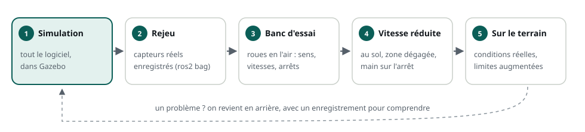

# De la simulation au robot réel

> **La situation.** Le logiciel du robot de livraison fonctionne parfaitement dans Gazebo. Demain, il tourne pour la première fois sur le vrai robot, dans l'entrepôt. Le laser voit des reflets, les roues patinent sur le sol lisse, le Wi-Fi coupe derrière les étagères… et si la téléopération se tait, le robot continue tout droit avec la dernière vitesse reçue. Avant d'appuyer sur « marche », il faut savoir ce qui va changer, et protéger le robot contre ce qui peut mal tourner.

**Dans ce module, vous allez :**

- comprendre l'écart entre la simulation et le monde réel : capteurs, actionneurs, temps ;
- savoir quoi calibrer avant de faire rouler un robot ;
- écrire une **couche de sécurité** : limites de vitesse, rampe d'accélération, chien de garde et arrêt d'urgence ;
- suivre une méthode pour passer de la simulation au robot, sans casse.

C'est un module bonus : il ne compte pas dans la note finale ni dans le certificat.

## L'essentiel en théorie

- Un simulateur est **trop parfait** : capteurs sans bruit, roues qui ne glissent pas, commandes appliquées instantanément. Un logiciel qui ne marche qu'en simulation n'est pas terminé.
- Les **capteurs réels** sont bruités, biaisés et dérivent ; les **actionneurs** saturent, ont une inertie et répondent avec retard.
- Les **mesures se calibrent** : rayon des roues, entraxe, position des capteurs sur le robot.
- La **sécurité** se construit en couches : un arrêt d'urgence matériel, puis une couche logicielle qui limite les vitesses, lisse les accélérations et arrête le robot quand les commandes cessent d'arriver (le **chien de garde**).
- On passe au réel **par étapes** : simulation, enregistrement, banc d'essai, vitesse réduite, puis conditions réelles.

## 1. L'écart entre simulation et réalité

| | En simulation | Sur le vrai robot |
|---|---|---|
| Capteurs | mesures exactes, ou bruit réglé à la main | bruit, biais, valeurs aberrantes, reflets |
| Roues | aucun glissement | glissement, usure, sol irrégulier |
| Moteurs | la vitesse demandée est atteinte aussitôt | inertie, accélération limitée, saturation, zone morte |
| Temps | l'horloge de la simulation, réglable | l'horloge réelle, avec latence et gigue |
| Réseau | parfait, sur une seule machine | Wi-Fi qui perd des paquets ou coupe |
| Une erreur | se corrige en relançant | abîme le robot, l'environnement, ou blesse quelqu'un |

La simulation reste indispensable : elle permet de développer et de tester sans risque, des centaines de fois. Mais elle se valide toujours sur le réel.

## 2. Les capteurs : bruit, biais et dérive

Toute mesure réelle est imparfaite :

- le **bruit** : la mesure fluctue autour de la vraie valeur (un laser donne 1,02 m, puis 0,98 m, puis 1,01 m pour le même mur) ;
- le **biais** : une erreur constante (une centrale inertielle qui indique 0,01 rad/s de rotation à l'arrêt) ;
- la **dérive** : une erreur qui s'accumule. L'odométrie en est l'exemple type : chaque petit glissement des roues s'ajoute aux précédents, et après 50 m, la position estimée peut être fausse de plusieurs dizaines de centimètres ;
- les **valeurs aberrantes** : un reflet sur une surface brillante, une mesure à l'infini.

On ne supprime pas ces erreurs, on les **gère** :

- **filtrer** : une moyenne glissante ou un filtre passe-bas lissent le bruit, au prix d'un peu de retard ;
- **rejeter** les valeurs impossibles (une distance négative, une vitesse de 10 m/s) ;
- **fusionner** plusieurs capteurs : l'odométrie des roues dérive lentement, la centrale inertielle mesure bien les rotations rapides. Un filtre de Kalman, comme celui du package `robot_localization`, combine leurs forces.

## 3. Les actionneurs : le robot n'obéit pas instantanément

Le nœud du parcours applique la vitesse demandée dès qu'il la reçoit. Un vrai moteur, non :

- **inertie** : passer de 0 à 0,5 m/s prend du temps ; une commande trop brutale fait patiner les roues ou basculer la charge ;
- **saturation** : au-delà d'une certaine vitesse, le moteur ne suit plus ;
- **zone morte** : en dessous d'un seuil, le robot ne bouge pas du tout (frottements) ;
- **latence** : entre la publication sur `/cmd_vel` et le mouvement des roues, il s'écoule plusieurs dizaines de millisecondes.

D'où la règle : **limiter l'accélération** des commandes, avec une rampe, plutôt que de faire confiance au moteur pour absorber les à-coups.

## 4. Le temps et les messages datés

Sur un vrai robot, chaque mesure arrive avec un retard différent. C'est pourquoi les messages de capteurs portent un en-tête avec leur **date de mesure** (`header.stamp`), et non leur date de réception : TF2 s'en sert pour savoir où était le robot *au moment* de la mesure.

- En simulation, les nœuds utilisent l'horloge de Gazebo (`use_sim_time: true`) ; sur le robot, l'horloge réelle. Mélanger les deux donne des transformations « dans le futur » ou « trop anciennes ».
- Sur plusieurs machines, les horloges doivent être **synchronisées** (avec `chrony`, par exemple) : un écart de quelques centaines de millisecondes suffit à fausser TF2.
- `ros2 topic delay` mesure le retard entre la date d'un message et sa réception.

## 5. Calibrer avant de rouler

La cinématique du robot repose sur deux mesures : le **rayon des roues** et l'**entraxe** (la distance entre les roues). Une erreur de 2 % sur le rayon donne 2 cm d'erreur à chaque mètre parcouru.

| À calibrer | Comment |
|---|---|
| Rayon des roues | faire avancer le robot de 5 m mesurés au sol ; corriger le rayon du rapport entre distance estimée et distance réelle |
| Entraxe | faire tourner le robot de 10 tours sur place ; corriger l'entraxe du rapport entre angle estimé et angle réel |
| Position des capteurs | mesurer la position du laser ou de la caméra sur le robot, et la publier en transformation fixe (TF2) |
| Centrale inertielle | mesurer son biais, robot immobile, avant chaque utilisation |

Ces valeurs vont dans des **paramètres** (le module Paramètres et fichiers launch) ou dans l'**URDF**, jamais en dur dans le code : elles changent d'un robot à l'autre.

## 6. La sécurité, en couches

Un robot mobile de 30 kg qui roule à 1 m/s peut blesser quelqu'un. La sécurité ne repose jamais sur un seul élément :

1. **L'arrêt d'urgence matériel** : un bouton rouge qui coupe l'alimentation des moteurs, indépendamment de tout logiciel. Indispensable : un logiciel peut planter.
2. **Une couche de sécurité logicielle**, un nœud placé juste avant le robot, par lequel passent toutes les commandes :
   - il **limite** les vitesses linéaire et angulaire ;
   - il **lisse** les accélérations, avec une rampe ;
   - il applique un **chien de garde** (*watchdog*) : sans nouvelle commande depuis un court délai, il arrête le robot. Si la téléopération plante ou si le Wi-Fi coupe, le robot s'arrête au lieu de continuer avec la dernière vitesse reçue ;
   - il offre un **arrêt d'urgence logiciel**, un service qui bloque toutes les commandes jusqu'à nouvel ordre.
3. **Les comportements de plus haut niveau** : ralentir près des obstacles, zones interdites, vitesse réduite près des personnes (c'est le travail de la navigation, avec Nav2).


Toutes les sources de commandes publient sur `/cmd_vel_brut` ; **seul** `garde_node` publie sur `/cmd_vel`. Sur le vrai robot, on remappe la téléopération et la navigation vers `/cmd_vel_brut` dans le fichier launch.

## 7. Pratique : écrire la couche de sécurité

Votre workspace `~/ws/14-robot-reel` reprend le robot du module Paramètres. Remarquez un défaut que vous n'aviez peut-être pas vu : `diff_drive_node` garde la dernière vitesse reçue **indéfiniment**. Publiez une commande, puis plus rien : le robot roule pour toujours. On ne modifie pas le robot ; on place devant lui `garde_node`.

```python fichier=src/my_pkg/my_pkg/garde_node.py
import rclpy
from geometry_msgs.msg import Twist
from rclpy.node import Node
from std_srvs.srv import SetBool

PERIODE = 0.05  # s : la couche de sécurité publie 20 fois par seconde


def clamp(value, limit):
    return max(-limit, min(value, limit))


def rampe(actuelle, cible, pas):
    """Rapproche la vitesse actuelle de la cible, d'au plus « pas »."""
    return actuelle + clamp(cible - actuelle, pas)


class GardeNode(Node):
    """Couche de sécurité devant le robot : limites, rampe, chien de garde et arrêt d'urgence."""

    def __init__(self):
        super().__init__('garde_node')
        self.declare_parameter('max_linear_speed', 0.3)   # m/s
        self.declare_parameter('max_angular_speed', 0.8)  # rad/s
        self.declare_parameter('max_linear_accel', 0.5)   # m/s²
        self.declare_parameter('cmd_timeout', 0.5)        # s sans commande avant l'arrêt
        self.max_v = self.get_parameter('max_linear_speed').value
        self.max_w = self.get_parameter('max_angular_speed').value
        self.pas_v = self.get_parameter('max_linear_accel').value * PERIODE
        self.timeout = self.get_parameter('cmd_timeout').value

        self.consigne = Twist()
        self.derniere_commande = None  # date de la dernière commande reçue
        self.arret_urgence = False
        self.coupe = True  # le chien de garde a-t-il arrêté le robot ?
        self.v = 0.0

        self.create_subscription(Twist, 'cmd_vel_brut', self.on_commande, 10)
        self.pub = self.create_publisher(Twist, 'cmd_vel', 10)
        self.create_service(SetBool, 'arret_urgence', self.on_arret_urgence)
        self.create_timer(PERIODE, self.step)
        self.get_logger().info(f'garde_node prêt : {self.max_v} m/s max, arrêt après {self.timeout} s sans commande')

    def on_commande(self, msg):
        self.consigne = msg
        self.derniere_commande = self.get_clock().now()

    def on_arret_urgence(self, request, response):
        self.arret_urgence = request.data
        response.success = True
        response.message = 'arrêt d\'urgence activé' if self.arret_urgence else 'arrêt d\'urgence levé'
        self.get_logger().warn(response.message)
        return response

    def commande_recente(self):
        if self.derniere_commande is None:
            return False
        age = (self.get_clock().now() - self.derniere_commande).nanoseconds * 1e-9
        return age < self.timeout

    def step(self):
        cmd = Twist()
        if self.arret_urgence:
            self.v = 0.0  # arrêt immédiat, sans rampe
        elif self.commande_recente():
            if self.coupe:
                self.get_logger().info('Commandes reçues : le robot repart')
                self.coupe = False
            self.v = rampe(self.v, clamp(self.consigne.linear.x, self.max_v), self.pas_v)
            cmd.angular.z = clamp(self.consigne.angular.z, self.max_w)
        else:
            if not self.coupe:
                self.get_logger().warn(f'Aucune commande depuis {self.timeout} s : arrêt du robot')
                self.coupe = True
            self.v = 0.0
        cmd.linear.x = self.v
        self.pub.publish(cmd)


def main(args=None):
    rclpy.init(args=args)
    node = GardeNode()
    try:
        rclpy.spin(node)
    except KeyboardInterrupt:
        pass
    finally:
        node.destroy_node()
        rclpy.try_shutdown()


if __name__ == '__main__':
    main()
```

Trois choix à remarquer :

- la date de la dernière commande est mise à jour **dans la fonction de rappel de l'abonnement**, à chaque commande reçue : c'est ce qui fait fonctionner le chien de garde ;
- `garde_node` publie **en continu**, même un zéro : le robot reçoit toujours une commande fraîche, et ce qu'il fait ne dépend que de la couche de sécurité ;
- l'arrêt d'urgence et le chien de garde arrêtent le robot **tout de suite**, sans rampe : en cas de doute, on s'arrête.

Un fichier launch démarre le robot et sa couche de sécurité :

```python fichier=src/my_pkg/launch/robot_securise.launch.py
import os

from ament_index_python.packages import get_package_share_directory
from launch import LaunchDescription
from launch_ros.actions import Node


def generate_launch_description():
    config = os.path.join(get_package_share_directory('my_pkg'), 'config', 'robot.yaml')

    return LaunchDescription([
        Node(package='my_pkg', executable='diff_drive_node', name='diff_drive_node',
             output='screen', parameters=[config]),
        # Seul garde_node publie sur /cmd_vel ; les commandes arrivent sur /cmd_vel_brut
        Node(package='my_pkg', executable='garde_node', name='garde_node', output='screen'),
    ])
```

Déclarez l'exécutable :

```python fichier=src/my_pkg/setup.py
from glob import glob

from setuptools import find_packages, setup

package_name = 'my_pkg'

setup(
    name=package_name,
    version='0.1.0',
    packages=find_packages(exclude=['test']),
    data_files=[
        ('share/ament_index/resource_index/packages', ['resource/' + package_name]),
        ('share/' + package_name, ['package.xml']),
        ('share/' + package_name + '/launch', glob('launch/*.launch.py')),
        ('share/' + package_name + '/config', glob('config/*.yaml')),
    ],
    install_requires=['setuptools'],
    zip_safe=True,
    maintainer='etudiant',
    maintainer_email='etudiant@ros-academy.local',
    description='Robot à conduite différentielle du parcours ROS 2 Fondamentaux',
    license='Apache-2.0',
    entry_points={
        'console_scripts': [
            'diff_drive_node = my_pkg.diff_drive_node:main',
            'garde_node = my_pkg.garde_node:main',
        ],
    },
)
```

Le `package.xml` du workspace déclare déjà `std_srvs`. Compilez et lancez :

```bash
cd ~/ws/14-robot-reel
colcon build --symlink-install
source install/setup.bash
ros2 launch my_pkg robot_securise.launch.py
```

Dans un second terminal, envoyez des commandes **pendant 2 secondes** (20 messages à 10 Hz), puis plus rien :

```bash
ros2 topic pub -r 10 -t 20 /cmd_vel_brut geometry_msgs/msg/Twist "{linear: {x: 1.0}}"
```

Observez le journal du lancement :

```text
[garde_node]: Commandes reçues : le robot repart
[garde_node]: Aucune commande depuis 0.5 s : arrêt du robot
```

Et vérifiez :

- la vitesse publiée a été limitée à 0,3 m/s, et elle a monté progressivement : `ros2 topic echo /cmd_vel --field linear.x` pendant l'envoi ;
- le robot s'est arrêté une demi-seconde après la dernière commande : `ros2 service call /get_pose my_interface/srv/GetPose` deux fois de suite donne la même position.

Essayez maintenant l'arrêt d'urgence, pendant que des commandes arrivent en continu :

```bash
ros2 topic pub -r 10 /cmd_vel_brut geometry_msgs/msg/Twist "{linear: {x: 0.2}}"
```

```bash
ros2 service call /arret_urgence std_srvs/srv/SetBool "{data: true}"    # le robot s'arrête net
ros2 service call /arret_urgence std_srvs/srv/SetBool "{data: false}"   # il repart
```

## 8. La méthode : du simulateur au robot, par étapes



1. **Simulation** : tout le logiciel tourne dans Gazebo, y compris la couche de sécurité.
2. **Enregistrement et rejeu** : on enregistre les capteurs du vrai robot (`ros2 bag record`), robot immobile ou poussé à la main, et on rejoue ces données réelles dans les nœuds.
3. **Banc d'essai** : roues en l'air, on vérifie le sens de rotation, les vitesses, le chien de garde et l'arrêt d'urgence.
4. **Vitesse réduite**, au sol, dans une zone dégagée, la main sur l'arrêt d'urgence : `max_linear_speed: 0.1`.
5. **Sur le terrain**, en conditions réelles, en augmentant progressivement les limites.

À chaque étape, on ne passe à la suivante que si tout se passe comme prévu ; sinon, on revient en arrière, avec un enregistrement pour comprendre.

## 9. Rappel

- La simulation est trop parfaite : capteurs bruités, roues qui glissent, latence et moteurs qui saturent attendent le logiciel sur le vrai robot.
- Filtrer, rejeter les valeurs aberrantes et fusionner les capteurs ; dater les mesures (`header.stamp`) et synchroniser les horloges.
- Calibrer le rayon des roues, l'entraxe et la position des capteurs ; ranger ces valeurs dans des paramètres ou l'URDF.
- Sécurité en couches : arrêt d'urgence matériel, puis un nœud de sécurité par lequel passent toutes les commandes (limites, rampe, chien de garde, arrêt d'urgence logiciel).
- Passer au réel par étapes : simulation, rejeu, banc, vitesse réduite, conditions réelles.

**Et maintenant ?** Vous avez bouclé les fondamentaux du logiciel robotique : un robot programmé, décrit, simulé, diagnostiqué et protégé. La suite, avec les parcours avancés : la navigation autonome, la perception et la manipulation.
